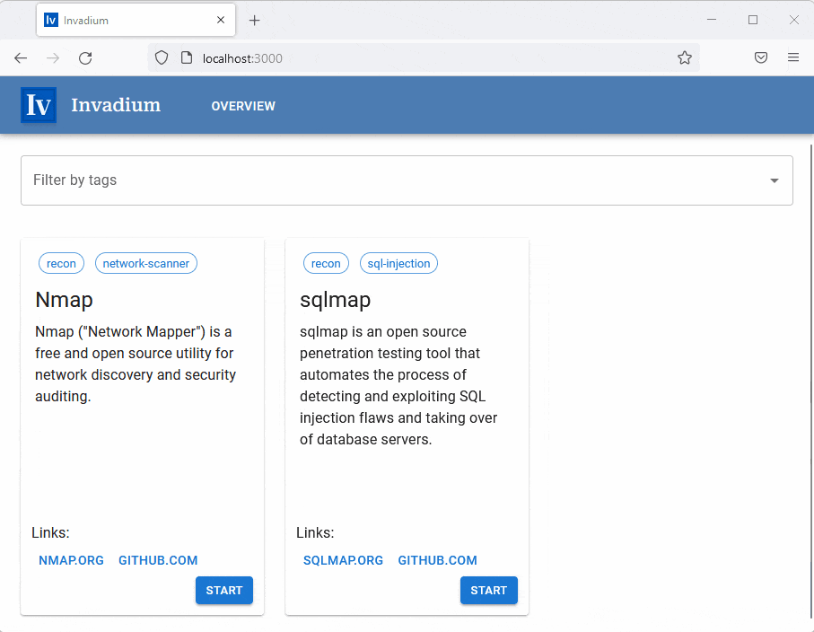
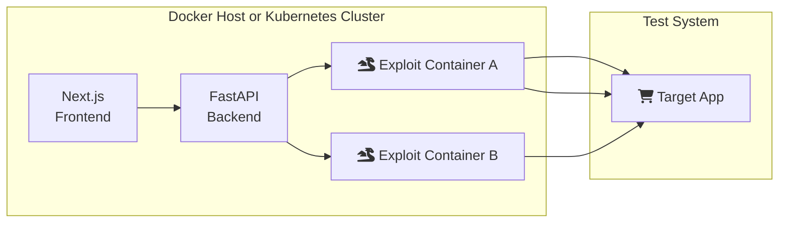

<!-- markdownlint-disable no-inline-html first-line-h1 -->


# Invadium

[](https://github.com/dynatrace-oss/invadium/releases/latest)
[](https://github.com/dynatrace-oss/invadium/actions)
[](LICENSE.txt)

Invadium runs exploits against one or more target applications in an intuitive,
reproducable, and well-defined manner. It focuses on bridging the gap between
developers that write exploits and presenters that use them for demos or
educational purposes.

- **Presenters** can easily navigate to the web UI of Invadium, chose from a
  selection of exploits and demo their individual attack steps, all within
  Invadium.
- **Exploit developers** define exploits by specifying a container image for it,
  environment variables for customization, and the individual commands that will
  be run at each step.

Of course, Invadium is not only built for exploits, you may solve similar
problems, e.g., showcasing new users how a tool of yours can be used, getting a
web UI for a set of commands that developers may regularly encounter, etc.

| ⚠️ This product is not officially supported by Dynatrace. |
| --------------------------------------------------------- |

## 🎬 Can I see it in action?

Sure! Below you see a presenter navigating to Invadium, selecting the
[Nmap](https://nmap.org/) network scanner and running only the first step of it,
a standard scan of the target address.

<p align="center">
  
</p>

What you are seeing above is defined in a so-called [exploit format](./docs/EXPLOITS.md).
Below you see an excerpt of how this can look like for the Nmap exploit. The
excerpt only shows one step, find the full file at [./exploits/config/nmap.yaml](./exploits/config/nmap.yaml)
or start writing your own today!

```yaml
id: nmap
name: Nmap
desc: |
  Nmap ("Network Mapper") is a free and open source utility
  for network discovery and security auditing.
image: ghcr.io/dynatrace-oss/invadium-nmap
env:
  - name: TARGET
    value: scanme.nmap.org
    desc: Target address to scan
steps:
  nmap_scan:
    name: Standard scan
    desc: Scans all reserved TCP ports on the target
    commands:
      - nmap -T$TIMING $OPTIONS $TARGET
    env:
      - name: TIMING
        value: 5
        desc: Timing template between 0 - 5 (higher is faster)
      - name: OPTIONS
        desc: Additional options for nmap
```

### How does this work under the hood?

Invadium is split into a [Next.js](https://nextjs.org/) frontend and a Python
backend, backed by [FastAPI](https://fastapi.tiangolo.com/).

1. Starting an exploit starts a new exploit container. If you run in `docker`
   mode, this spawns a new Docker container. If you run in `kubernetes` mode, a
   new pod is spawned in your namespace.
2. When you execute individual steps, the backend will run `docker exec` and
   `kubectl exec`, respectively, and stream the logs into the frontend. One
   exploint container can run one more steps.
3. When you end your session, or after a certain timeout, the spawned containers
   or pods will be deleted again.



## 🐳 Quick Start with Docker

You already have [Docker](https://docs.docker.com/get-docker/) and
[Compose](https://docs.docker.com/compose/install/) installed? Awesome! Just run
the following command. <sup>1</sup>

```sh
docker-compose up --no-build -d
```

- **Browse the frontend at [localhost:3000](http://localhost:3000)**
- You may also take a look at the API docs at
  [localhost:3001](http://localhost:3001)

You should see the [sqlmap](https://sqlmap.org/) and [Nmap](https://nmap.org/)
exploits that are read from [`./exploits/config`](./exploits/config). Find the
exploit format specification [over here](./docs/EXPLOITS.md) if you want to
start writing your own!

<small><sup>1</sup> This will pull images from GHCR.io - if you want to re-build
the containers yourself, add `--build` to the command.</small>

## ⚓ Kubernetes Deployment

Invadium is ready for Kubernetes! Find detailed guides [over here](./docs/KUBERNETES.md).

## 💻 Local Development

Planning to extend or adapt Invadium? This might be valuable for you:

- Find guides on how to best setup and develop Invadium locally [over here](./docs/DEVELOPMENT.md)
- Want to write your own exploits? Read the exploit format specification [over here](./docs/EXPLOITS.md)
- Please also note our [contribution guidelines](./CONTRIBUTING.md),
  [code of conduct](./CODE_OF_CONDUCT.md), and [security policy](./SECURITY.md)

## ⚙️ Configuration

### Backend Directories

The backend expects exploit YAML files in the directory that you specified with
the environment variable `INVADIUM_CONFIG_PATH`. This needs to be set when you
start the Python backend. In our container images this is set to `/config` by
default. You can mount your exploit YAML files there.

### Backend Environment Variables

| Variable                                  | Type        | Description                                                      | Default         |
| ----------------------------------------- | ----------- | ---------------------------------------------------------------- | --------------- |
| `INVADIUM_CONFIG_PATH`                    | `str`       | Path where the exploit config YAML files are located             | not set         |
| `INVADIUM_API_PORT`                       | `int`       | Port where the backend API will listen                           | `3001`          |
| `INVADIUM_API_ROOT`                       | `str`       | Prefix that is appended to API routes and the docs <sup>1</sup>  | `/api`          |
| `INVADIUM_CORS_ORIGINS` _(optional)_      | `list[str]` | Origins that are allowed to call the backend <sup>2</sup>        | not set         |
| `INVADIUM_EXPLOIT_RUNTIME`                | `str`       | Runtime to use for exploit containers (`docker` or `kubernetes`) | `docker`        |
| `INVADIUM_EXPLOIT_TIMEOUT`                | `int`       | Amount of seconds after an idle exploit container is deleted     | `900` _(15min)_ |
| `INVADIUM_DOCKER_NETWORK` _(optional)_    | `str`       | Spawns docker containers in a certain `--network` <sup>3</sup>   | not set         |
| `INVADIUM_KUBERNETES_NAMESPACE`           | `str`       | Kubernetes namespace where new exploit pods are spawned          | `invadium`      |
| `INVADIUM_KUBERNETES_POD_CPU_REQUESTS`    | `str`       | CPU requests per exploit pod in Kubernetes                       | `100m`          |
| `INVADIUM_KUBERNETES_POD_CPU_LIMITS`      | `str`       | CPU limits per exploit pod in Kubernetes                         | `250m`          |
| `INVADIUM_KUBERNETES_POD_MEMORY_REQUESTS` | `str`       | Memory requests per exploit pod in Kubernetes                    | `250Mi`         |
| `INVADIUM_KUBERNETES_POD_MEMORY_LIMITS`   | `str`       | Memory limits per exploit pod in Kubernetes                      | `500Mi`         |

<sup>1</sup> For example, when you set this to `/api` you can then fetch from
`localhost:3001/api/exploits`. Also, the documentation will be available at this
location, e.g. browse `localhost:3001/api` to see the Swagger docs. In our
container images, this is set to `/api` by default to allow for prefix-routing.
Locally, there is no prefix defined.

<sup>2</sup> Put in the URL of the frontend if it has a different origin than
the backend. For a local setup, you best set this to `["http://localhost:3000", "http://127.0.0.1:3000"]`.

<sup>3</sup> For example, this can be set to `host` to spawn exploit containers
in the same network as the Docker host. In some local setups, this can make it
easier to reach target apps from the exploit containers.

<sup>4</sup> Check the [official docs](https://kubernetes.io/docs/concepts/configuration/manage-resources-containers/)
to learn more about requests and limits.

### Frontend Environment Variables

| Variable               | Type  | Description                                              | Default |
| ---------------------- | ----- | -------------------------------------------------------- | ------- |
| `NEXT_BACKEND_API_URL` | `str` | Absolute or relative URL to the backend API <sup>1</sup> | not set |

<sup>1</sup> This URL must be reachable from the browser window of the user. If
you supply a relative URL, the `window.location.origin` will be prepended.
